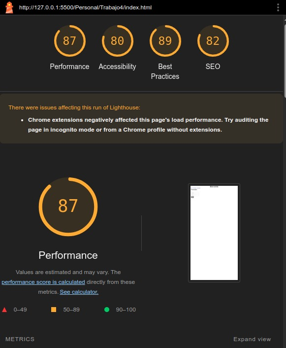
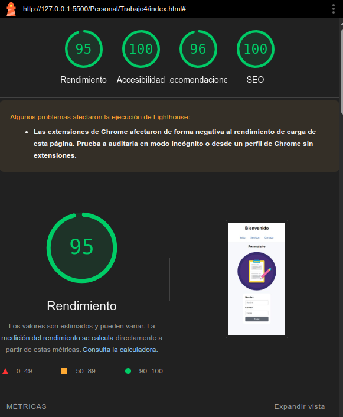

# Auditoría UX Rápida

## Lighthouse al inicio:

## Incidencia 1
Heurística: Visibilidad del estado del sistema.

Problema: El formulario solo mostraba mensajes genéricos ("Error" / "Enviado") sin indicar qué campo falló ni estado visual claro.

Mejora: Se implementaron mensajes descriptivos y en tiempo real para nombre, con estados visuales de éxito (verde) y error (rojo), además de aria-live para anunciar cambios.

## Incidencia 2
Heurística: Prevención de errores.

Problema: El usuario podía intentar enviar datos vacíos o correo inválido sin guía previa; no existían labels ni atributos de accesibilidad adecuados.

Mejora: Se agregaron labels, validación de nombre, marcado aria-invalid en campos con error, focus visible y mejoras visuales del formulario.

## Cambios adicionales de mejora técnica
- Se añadió meta viewport y meta description para mejorar SEO y adaptación móvil.
- Se añadió defer al script para no bloquear renderizado.
- Se corrigió imagen con src válido, alt descriptivo, width y height explícitos y loading lazy.

## Lighthouse despues de los cambios

